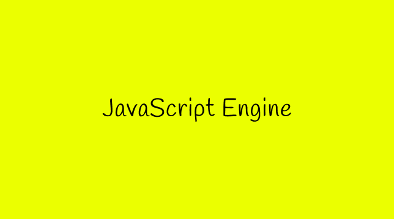
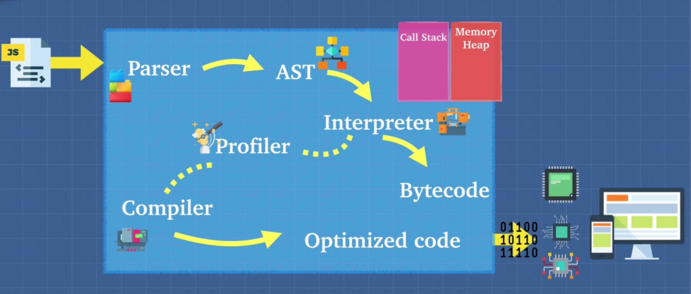

Have you ever asked yourself what the hell is Engine, why we need it , why not  just write code and execute in the browser directly without an engine ,so  let me give you an example why we need it .

If I write some code like let's say cost is happy equals to true :

```jsx
const happy = true;
```

Well we just wrote some JavaScript , Now how do we read this or how does the computer read this.
Imagine if somebody comes up to you and gives you a computer and they tell you hey tell this computer to display a picture of horses on the screen and you start looking at this computer and you tell the computer to display an image of a horse or horses in French is the computer going to understand you know the computer would have no idea what you just said in similar fashion.

the Reaction of computer will be like this.


If I gave a computer with a CPU a file that is a javascript file and I tell it hey read this file and do something for me. Well the computer only understands ones and zeros at the end of the day. So the computer doesn't really know what javascript is

So anytime we use an engine we're able to give it a javascript file and this javascript file gets understood by the engine and it allows this engine to communicate and tell the machine or the computer to do what we ask it to do ,but what is inside this engine, this magical machine that understands javascript it reads our code and then it runs this code.

Let's get into that

# Inside JavaScript Engine :

A JavaScript engine is a computer program that you give JavaScript code to and it tells the computer how to execute it. Basically a translator for the computer between JavaScript and a language that the computer understands. But what happens inside of the engine? Well, that depends on the engine. There are many JavaScript Engines out there you can know more about them **[here](https://en.wikipedia.org/wiki/List_of_ECMAScript_engines#:~:text=Carakan%3A%20A%20JavaScript%20engine%20developed,engine%20used%20in%20Internet%20Explorer.) .**



The first thing that happens within the JavaScript engine is parsing of our code by parser. A parser basically reads our code line by line and checks it for errors and stops execution if any, if the code is free of syntactic errors, the parser produces a data structure called abstract syntax tree, which is then translated to machine code and thus results in output.

## **Abstract Syntax Tree (AST)**

The parser produces a data structure called the Abstract Syntax Tree or AST. AST is a
tree graph of the source code that does not show every detail of the original syntax, but
contains structural or content-related details. Certain things are implicit in the tree and
do not need to be shown, hence the Btle abstract.

## **Profiler :**

The profiler is responsible for checking our code. It also calls a monitor that monitors and watches our code as it runs and makes notes on how we could optimize this code. Ex: How many times it is being run? What types are used? How can we optimize this code?
So, if the profiler finds some code that can be optimized, it passes this code to the Just-In-Time (JIT) compiler, so it can be compiled and runs faster.

## **Interpreter :**

An interpreter directly executes each line of code line by line, without requiring them to be compiled into a machine language program. Interpreters can use different strategies to increase performance. They can parse the source code and execute it immediately,translate it into more efficient machine code, execute precompiled code made by a compiler, or some combination of these In the V8 engine, the interpreter output bytecode. In addition, it Keeps translating the program continuously till the first error is confronted. If any error is spotted, it stops working and hence debugging becomes easy. On the negative side , interpreted programs can only run on the computers that have the respective interpreters.

## **THE COMPILER**

The compiler works ahead of Bme to convert instructions into a machine-code or lower-level form so that they can be read and executed by a computer. It runs all of the code and tries to figure out what the code does and then compiles it down into another language that is easier for the computer to read. Have you heard of Babel or Typescript? They are heavily used in the Javascript ecosystem and you should now have a good idea of what they are. Babel is a JavaScript compiler that takes your modern JS code and returns browser compaBble JS (older JS code). Typescript is a superset of Javascript that compiles down to JavaScript. Both of these do exactly what compilers do. Take one language and convert into a different one!

In modern engines, the interpreter starts reading the code line by line while
the profiler watches for frequently used code and flags then passes is to the compiler to be optimized. In the end, the JavaScript engine takes the bytecode the interpreter
outputs and mixes in the optimized code the compiler outputs and then gives that to the
computer. This is called "Just in Time" or JIT Compiler.
